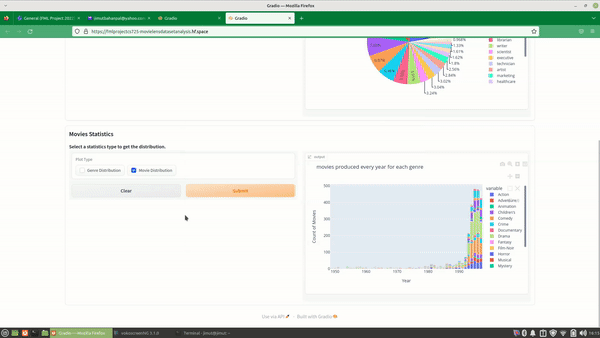

# CS-725 Foundations of Machine Learning Project, IIT Bombay
***

### Topic: **Solving the Cold Start problem in Recommendation Systems - Case Study on MovieLens Dataset**

### Team Members: **Prateek Chanda (22D0362), Sandarbh Yadav (22D0374), Jimut Bahan Pal (22D1594) and Goda Nagakalyani (214050010)**

Instructor: [Preethi Jyothi](https://www.cse.iitb.ac.in/~pjyothi/)

Demo using Gradio:

  

Gradio demonstration links: [MovieLens Dataset Analysis](https://fmlprojectcs725-movielensdatasetanalysis.hf.space/) & [MovieLens Final Top K recommendations](https://fmlprojectcs725-recommendationmovielens.hf.space/)

Instructions for running the code:

1. Install tensorflow, numpy, pandas etc.
2. Clone the repository
3. Run mainSol.py using command: python mainSol.py

To run lightGCN++, in mainSol, pass argument defaultMode=False, else to run LightGCN, pass argument defaultMode=True

Note: LightGCN.py contains the implementation of LightGCN model and recommendation.py contains the gradio code for making recommendations.

***
